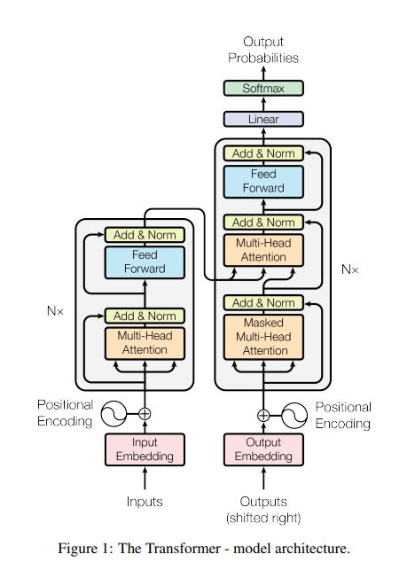

# Attention is all you need

Created: 2025년 7월 19일 오후 7:01

# Introduction

이전까지 sequence modeling이나 transduction problem 에는 RNN, LSTM 이 주로 사용되어 왔음.

그러나 RNN은 순차적인 특성( $h_{t-1}$를 먼저 알아야 $h_t$를 알 수 있음.)  때문에 병렬 처리를 하기 쉽지 않았음. 

→ sequence 길이가 길어질수록 문제가 됨.

Attention mechanism은 sequence 안에서의 거리와는 상관없이 의존성을 모델링할 수 있음. 그러나 이전에는 attention이 거의 항상 RNN이나 LSTM에 결합되어 사용되었음.

→ 오로지 attention만 사용하는 transformer라는 모델을 개발. → 병렬 처리 가능. 성능 우수.

# Background

Extended Neural GPU, ByteNet, ConvS2S 등에서도 순차적 연산을 줄이려는 시도는 있었지만, 모두 CNN을 사용했음. → 입출력의 관련성을 얻기 위한 계산량이 그 입출력 간의 거리에 따라 상승함.

Transformer는 이 계산을 상수 시간 안에 가능. (Multi-Head Attention을 사용하여)

Self-attention : 한 sequence 안의 다른 위치 간에 attention을 적용. 

(+) → sequence의 새로운 표현을 구성. (sequence 전체의 정보를 종합하여)

End-to-end memory networks : 재귀적인 attention 매커니즘.

(+) 외부 메모리를 사용해서 입력 context로부터 복잡한 reasoning을 수행하고 그 결과를 end-to-end 방식으로 학습하는 모델.

# Model Architecture

transformer 모델 구조.

왼쪽 : encoder / 오른쪽 : decoder.

### Encoder

a stack of N = 6 identical layers.
각 레이어는 두 개의 sub-layer로 구성. Residual connection + LayerNorm사용.

각 sub-layer의 출력 : $LayerNorm(x+Sublayer(x))$

출력은 모두 $d_{model}=512$로 통일. → residual connection을 용이하게 하기 위함. (512라는 숫자는 안 중요하고 통일을 한다는 게 핵심.)

$d_{model}$ : 임베딩 차원

### Decoder

encoder와 같이 stack of N = 6 identical layers.

Residual connection + LayerNorm 사용.

encoder의 구조에서 새로운 sub-layer가 하나 더 추가됨 :

→ encoder stack의 최종 출력을 받아서 multi-head attention을 수행하는 layer

decoder stack의 self-attention에서 현재 이후의 위치를 참조 못하게 막음. → “Masked Multi-Head Attention”

(+) ex :

정답 시퀀스 : [I, am, a, student]

Decoder에 주는 입력 (output embedding) - [`<s>`, I, am, a] (한 칸씩 밀려있음)

그런데 `<s>`, I 만을 가지고 am을 예측해야 하는데 이때 뒤의 am, a를 참조해서는 안 됨. → masking으로 방지.

## Attention

attention function : query와 key-value pair를 output에 mapping.

output = value들의 가중치합. 가중치는 query와 key 들의 유사도(compability)로 결정.

(+)

Query : 현재 처리하는 단어가 어떤 정보를 참고해야 할지 묻는 질문

Key : 원문의 각 단어들이 어떤 정보(의미)를 가지고 있는지를 나타내는 인덱스

Value : 원문 각 단어들이 실제로 담고 있는 구체적인 의미 정보

### Scaled Dot-Product Attention

$$
\mathrm{Scaled\ Dot-Product \ Attention} = \frac{q^\top k}{\sqrt{d_k}}
$$

→ query와 key를 내적하고 $\sqrt {d_k}$로 나누어줌. (스케일 조정)

$q,k\in \mathbb R^{d_k}$ : 각각 query, key 벡터.

$d_k$ : query와 key의 차원.

$d_v$ : value의 차원. (이 논문에서는 $d_k$랑 같음.)

$n$ : sequence 길이.

$$
\mathrm{Attention}(Q, K, V) = \mathrm{softmax}\left( \frac{QK^\top}{\sqrt{d_k}} \right) V
$$

Scaled Dot-Product Attention을 행렬 형태로 나타낸 것. (시퀀스 전체를 한 번에 처리)

$Q,K \in \mathbb R^{n \times d_k}$ : 각각 query matrix, key matrix.

$QK^\top \in \mathbb R^{n\times n}$ : (i, j) 원소는 i번째 query가 j번째 key와 얼마나 유사한지를 의미함. 

                                (i번째 query 위치에서 j번째 value를 얼마나 반영할지)

$V \in \mathbb R^{n \times d_v}$ : value matrix

$output \in \mathbb R^{n \times d_v}$

(여기서 softmax는 row-wise 방향으로 적용됨. 그래야 value에 대한 가중치합이 됨.)

### Multi-Head Attention

$d_{model}$ 차원의 key, value, query에 단일 attention을 적용하는 것이 아니라, 이것들을 각각 $d_k, d_k, d_v$ 차원에 h번 다르게 선형 변환 시키고, 그렇게 h번 scaled dot-product attention을 수행한 후 결과들을 섞어서 사용하겠다.

→ 모델이 각 위치의 정보들을 다양한 의미 공간에서 해석 가능.

$$
MultiHead(Q,K,V) = Concat(head_1, ..., head_h)W^O \\ \text{where } head_i = Attention(QW_i^Q, KW_i^K, VW_i^V)
$$

$Q,K,V \in \mathbb R^n\times d_{model}$ : Scaled Dot-Product Attention 설명할 때 나왔던 $Q,K,V$랑은 다른 것.

(그 $Q,K,V$가 여기서는 $QW_i^Q, KW_i^K, VW_i^V$ 에 해당함.)

$W_i^Q, W_i^K \in \mathbb R^ {d_{model} \times d_k}$

$W_i^V \in \mathbb R^ {d_{model} \times d_v}$

$W^O \in \mathbb R^ {hd_v \times d_{model}}$

Concat은 열방향.

이 논문에서는 $d_k = d_v = d_{model}/h = 64$로 설정.

( $hd_v \ne d_{model}$ 이어도 수식 상 문제는 없지만 $hd_v$가 너무 작으면 표현력이 감소되고, 너무 커지면 전체 연산량이 $d_{model}$ 차원에서 단일 attention을 수행할 때보다 커지므로, 계산량을 단일 attention과 비슷한 수준으로 유지하면서 표현력을 최대로 높이기 위해 이와 같이 설정. 이렇게 이해하긴 했는데 정확하지는 않음.)

### Applications of Attention in Transformer

Transformer에서 attention은 세 가지 방식으로 사용됨.

1. encoder-decoder attention

이전 decoder layer로부터 query를, encoder의 출력으로부터 key와 value를 생성. decoder의 각 position이 input sequence의 모든 position을 참조할 수 있도록 함.

2. self-attention layers in the encoder

이전 encoder layer로부터 query, key, value를 생성. encoder의 각 position이 이전 encoder layer의 positon을 참조할 수 있도록 함.

3. self-attention layers in the decoder (masked)

encoder의 self-attention와 유사. decoder의 각 position이 해당 position 이전의 position(in the decoder)을 참조할 수 있도록 함. (Auto-regressive property를 띄게 하려면 미래의 token을 참조하면 안 되기 때문.)

→ 현재 position 이후에 대한 scaled dot-product attention 값을 $-\infty$로 설정. → softmax 값을 거의 0이 되도록 함.

### Position-wise Feed-Forward Networks

$$
FFN(x) = \max(0,xW_1 + b_1)W_2 + b_2
$$

→ two-layer network with ReLU activation.

input, output 차원 = $n \times d_{model}$

$d_{ff}$(은닉층 차원) = 2048

각 position들에 대해 separately, identically 진행됨. → “position-wise” 

(계산 과정 내내 행 size는 n이고 중간에 각 행이 섞이지도 않으니까 직관적으로 이해 가능)

### Positional Encoding

Transformer 모델은 convolution이나 재귀를 사용하지 않기 때문에, 모델이 sequence들의 각 단어에 대한 위치 정보를 알 수가 없음 → 위치 정보를 나타내는 “Positional Encoding” 벡터를 더해줌.

$$
PE_{(pos,2i)} = sin(pos/10000^{2i/d_{model}}) \\ PE_{(pos,2i+1)} = cos(pos/10000^{2i/d_{model}})
$$

$n \times d_{model}$ 형상의 matrix. 

하나의 열(embedding dimension)만 잘라서 보면 특정 주기의 사인, 코사인 함수.

주기는 $2\pi$부터 $10000\cdot2\pi$까지 모두 다름.

→ 각 element가 모두 다른 값을 가짐.

또한 사인, 코사인 함수는 덧셈정리에 의해 다른 사인, 코사인함수의 선형 조합으로 변경 가능.

$$
\sin\left( \frac{pos + k}{\omega} \right) = \sin\left( \frac{pos}{\omega} \right)\cos\left( \frac{k}{\omega} \right) + \cos\left( \frac{pos}{\omega} \right)\sin\left( \frac{k}{\omega} \right)
$$

# Why Self-Attention

Recurrent, Convolutional layer 등과 비교했을 때 Self-Attention layer는 :

1. 계산 시간복잡도 낮음. (보통 $n < d$ 이기 때문에 Recurrent layer보다도 시간복잡도 낮음.)
2. 순차적 계산 없음 → 병렬 처리 성능 매우 우수
3. Maximum path length 작음. i.e. position들 간의 거리가 멀어도 한 번에 dependency 계산 가능. 

# Training

WMT 2014 English-German, English-French dataset 사용.

Optimizer : Adam ( $\beta_1 = 0.9,\ \beta_2 = 0.98$ )

learning rate:

$$
d_{\text{model}}^{-0.5} \cdot
\min\left(
\text{step}^{-0.5},\ 
\text{step} \cdot \text{warmup}^{-1.5}
\right)
$$

where

$$
\text{warmup} = 4000
$$

Dropout( $P_{drop} = 0.1$ ), Label Smoothing( $\epsilon = 0.1$ ) 사용.

# Results

Machine Translation 뿐만 아니라 English Constituency Parsing task에 대해서도 우수한 성능을 보임.
