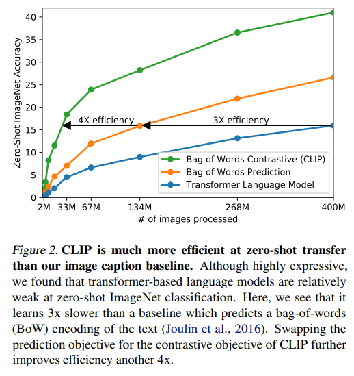

# Learning Transferable Visual Models From Natural Language Supervision

Created: 2025년 8월 22일 오후 3:55

https://proceedings.mlr.press/v139/radford21a/radford21a.pdf 짧은버전

# Introduction

NLP에서는 raw text를 이용한 pre-training(웹 텍스트 기반), task 특화되지 않은 범용 objective, text-to-text 인터페이스 덕분에 모델들이 zero-shot으로 다양한 태스크를 잘 수행할 수 있게 되었음. (GPT-3 등.)

→ 비전 분야에도 비슷하게 적용 가능할까?

이미 오래전부터 이미지+텍스트를 활용해서 이미지 표현을 학습하려는 시도가 있었음.

VirTex, ICMLM, ConVIRT 등 …

하지만 natural language supervision 접근은 성능이 너무 낮아서 잘 쓰이지 않았음.

대신 weak supervision 방식은 성능 향상에 성공했음. (인스타그램 해시태그 예측, JFT-300M noisy 레이블 등)

weak supervision : 완벽히 정답이 아닌, 부정확하거나 간접적인 label을 학습에 활용하는 것.

→ 하지만 위의 두 연구는 각각 1000개, 18291개 클래스로 범위를 제한함.

→ 자연어의 generality와 유연성을 반영할 수 없음. zero-shot 능력 또한 한정.

weakly supervised 모델에 비해 natural language supervision이 성능이 낮았던 이유? → 학습 데이터의 scale 때문. 이 논문에서는 이런 격차를 메꾸고 대규모 natural language supervision을 진행하고자 함.

인터넷에서 4억 쌍의 image-text pair 구축. ConVIRT를 단순화한 구조 사용. 

→ **“CLIP” (Contrastive Language-Image Pre-training)**

[앞으로 제시할 내용 요약]

- 계산량이 약 100배 차이나는 8개 모델을 학습시켜 CLIP의 확장성을 연구함 → transfer 성능이 계산량에 대한 함수로서 smoothly predictable하다는 것을 연구함.
- CLIP이 GPT 계열과 유사하게 OCR, geo-localization, action recognition 등 다양한 태스크 수행 능력을 학습함을 발견함.
- 30개 이상의 데이터셋에대해 zero-shot transfer 성능으로 벤치마킹. → 기존 태스크 특화 supervised 모델들과 경쟁 가능한 수준.
- linear-probe representation learning 분석 수행. CLIP 이 가장 성능이 좋았던 공개 ImageNet 모델보다 더 뛰어났음.
- 비슷한 정확도를 가진 suipervised ImageNet 모델에 비해 CLIP이 훨씬 더 robust함.

# Approach

## Natural Language Supervision

핵심 : 자연어에 포함된 supervision으로부터 학습. → natural language supervision이라고 명명.

과거엔 자연어를 학습에 쓰려 해도 n-gram 등으로만 사용해야 해서 제한적이었지만, 최근에는 GPT, BERT 같은 deep contextual representation learning 덕분에 natural language supervision이 진짜 가능해졌음.

natural language supervision의 장점 : 크라우드소싱 라벨링보다 훨씬 쉽게 확장 가능, representation을 학습하는 것으로 끝이 아니라 이를 언어와 연결함 → 유연한 zero-shot transfer 가능.

natural language supervision의 단점 : 인터넷 텍스트에 포함된 supervision으로부터 수동적으로 학습해야함.

## Creating a Sufficiently Large Dataset

기존 연구들은 보통 MS-COCO, Visual Genome, YFCC100M 데이터셋을 사용함.

MS-COCO, Visual Genome은 약 10만장으로 너무 적고, YFCC100M은 1억 개지만 각 이미지의 metadata가 희소하고 품질도 제각각임.

→ 인터넷으로부터 4억 개의 image-text pair를 수집하여 새로운 데이터셋 구축함. → WIT (WebImageText)

## Selecting an Efficient Pre-Traning Method

최근 비전 분야의 SOTA 모델들은 매우 큰 연산량을 가짐. 

→ 자연어로 학습하려면 training efficiency가 중요하겠구나. 

→ 처음에는 VirTex처럼  이미지 CNN + 텍스트 Transformer를 처음부터 같이 학습시켜 이미지의 캡션을 예측하도록 했는데, 너무 비효율적이었음.

→ 최근 연구에 따르면, 이미지에 붙는 텍스트의 정확한 단어들을 예측하는 것보다, contrastive objective를 사용하는 것이 더 좋다고 함.

→ **이미지-텍스트 매칭 문제로 단순화시키자. (contrastive objective 사용)**

batch에 N개의 image-text pair가 주어졌을 때, 그 batch에서 가능한 N x N개의 (image, text) 조합 중 실제로 짝지어진 것이 무엇인지 예측하도록 학습.

→ multi-modal embedding space를 학습해야함 :

**실제 짝지어진 N개의 쌍은 cosine similarity를 최대화, 나머지 $N^2-N$쌍은 cosine similarity를 최소화시킴. (올바른 쌍은 가까이, 틀린 쌍은 멀리)**

similarity score에 대해 symmetric cross entropy loss 최적화.

- CLIP은 from scratch로 학습됨. (사전학습된 가중치로 초기화 x)
- 각 인코더의 representation에서 linear projection을 거쳐 multi-modal embedding space로 mapping.
- data augmentation은 resize 후 random square crop뿐임.
- temperature 파라미터 $\tau$(softmax에서 logit 범위를 제어하는 역할)는 하이퍼파라미터가 아니라 학습 과정에서 직접 최적화되도록 함. (temperature가 작으면 정답과 오답을 더 강하게 구분, 크면 여러 클래스 확률이 비슷하게 퍼짐.)

### Choosing and Scaling a Model

1. 이미지 인코더 후보 두 가지 : ResNet-50 based & ViT

ResNet 개선 : ResNet-D 개선, antialiased rect-2 blur pooling 도입. global average pooling layer → attention pooling 대체.

ViT 수정 : patch + position embedding 합친 후 입력시키기 전에 LayerNorm 추가. 초기화 방식 약간 변경.

1. 텍스트 인코더 : Transformer 기반. 63M 파라미터, layer = 12, hidden size = 512, attention head = 8

텍스트를 소문자로 바꾼 뒤 Byte Pair Encoding으로 변환한 입력 사용. vocab size = 49,152

max sequence length = 76

Transformer의 마지막 layer에서 [EOS] 토큰 위치의 활성화 값을 텍스트의 feature representation으로 사용. → LayerNorm + linear projection을 거친 뒤 multi-modal embedding space로 매핑.

masked self-attention 사용 → 이후에 language modeling을 사용할 가능성 열어둠.

EfficientNet 연구에 따르면, width나 depth 중 하나만 늘리는 것 보다 골고루 늘리는 것이 더 성능이 좋다고 함.

→ 이미지 인코더 : width, depth, resolution 동일 비율로 늘림.

     텍스트 인코더 : 이미지 인코더의 width에 비례해서 width만 늘려줌. (성능에 별 영향이 없다고 함.)

### Training

- 5개의 ResNet, 3개의 ViT 모델 학습.
- ResNet-50, ResNet-101 + EfficientNet-style scaling 적용해서 만든 ResNet-50보다 4배, 16배, 64배 큰 모델. (RN50x4 등으로 표기)
- ViT-B/32, ViT-B/16, ViT-L/14 학습.
- epoch = 32 / Optimizer = Adam / decoupled weight decay regularization 모든 weight에 적용.
- learning rate는 cosine schedule로 감소시킴.
- $\tau$ = 0.07로 초기화. (temperature)  & logit이 100배 이상 scaling 되지 않도록 clip.
- minibatch size = 32,768
- mixed-precision, gradient checkpointing, half-precision Adam statistics, half-precision stochastically rounded text encoder weights 사용 (메모리 절약 목적)
- 임베딩 유사도 계산 시 각 GPU가 자기 local batch에 필요한 부분만 계산하게 함. (sharding)
- ViT-L/14 모델은 336 pixel resolution에서 한 에폭 추가 학습을 함. → ViT-L/14@336px

# Experiments

## Zero-Shot Transfer

### Motivation

zero-shot learning : 학습 시에 보지 못했던 객체 카테고리에 대해 일반화 → 보지 못한 데이터셋에 대한 일반화로 확장.

NLP에서 처음보는 task에 대해서도 일반화가 잘 되는 현상 관측됨. → CLIP의 연구 동기

### Using CLIP for zero-shot transfer

이미지 인코더 : CV backbone / 텍스트 인코더 : weight를 생성하는 hypernetwork 역할.

CLIP의 사전학습 : 32,768개의 클래스에 대한 proxy classification

zero-shot 시에는 weight(text embedding)을 클래스 별로 한 번씩만 계산하고 이를 재사용함 → 연산량 절감.

### Initial comparison to visual n-grams

Visual N-grams 보다 훨씬 좋았음. ImageNet 데이터셋 활용하지 않고도 ResNet-50 성능 수준 달성.

### Prompt engineering and ensembling

많은 기존 데이터셋은 레이블이 자연어 기반 zero-shot transfer를 고려하지 않고 만들어짐.

(숫자 id 기반 레이블, 임의적인 레이블 등..)

또한 zero-shot transfer를 할 때 데이터셋의 레이블이 단어 하나라면 동음이의어 문제가 생기며, 사전학습 데이터에서는 문장 단위였기 때문에 학습 시와 추론 시의 분포가 달라질 수 있음.

1. “dog” → “A photo of a dog” 으로 바꾸는 prompt engineering 사용. → ImageNet에서 약 +1.3% 정확도 개선.
    
    그리고 여기에 더해 데이터셋 성격에 맞는 문맥을 추가하면 성능이 더 좋아졌음. (e.g. Oxford-IIIT Pets: “A photo of a {label}, a type of pet.”)
    
2. “A photo of a big {label}”, “A photo of a small {label}” 처럼 서로 다른 context prompt를 ensemble.
    
    확률 공간이 아니라 text embedding space에서 ensemble 수행 → 추론 시에 원래와 똑같은 계산량 유지 가능.
    

→ prompt engineering + ensembling 사용 결과.

### Analysis of zero-shot CLIP performance

zero-shot CLIP vs Baseline (ResNet-50 + fully supervised, regularized logistic regression classifier) 성능 비교.

27개 데이터셋중 16개에서 CLIP이 승리.

림프절 종양 탐지(PatchCamelyon) 등 복잡한 태스크에서는 CLIP의 성능이 낮았음. 그런데 이건 인간도 마찬가지라서 .. zero-shot으로 수행하는 평가 방법론 자체가 공정한지 의문은 있음.

zero-shot CLIP vs 다른 모델들의 few-shot.

zero-shot CLIP은 4-shot logistic regression과 비슷한 수준.

자연어로 직접 개념을 정의해줄 수 있는 CLIP과 달리 few-shot은 예시 데이터만 보고 개념을 간접 추론해야 하므로, 1-shot이나 2-shot 보다 zero-shot CLIP이 더 안정적일 수 있음.

→ 데이터셋 별 zero-shot CLIP 수준의 성능을 내려면 몇 개의 shot이 필요한지 추정.

평균 = 20.8, 중앙값 = 5.4

zero-shot classifier 역시 linear classifier 이므로, fully supervised classifier가 zero-shot transfer 성능의 upper bound를 대략적으로 나타낸다고 볼 수 있음.

(이미지-텍스트 별로 하나씩 내적이 되므로, text embedding을 마치 선형 분류기의 weight 처럼 생각할 수 있음.)

→ zero-shot classifier vs fully supervised classifier 성능 비교 결과.

점선(y=x)가 upper bound.

대부분의 데이터셋에서 upper bound보다 10%~25% 낮음. → 개선 가능성 제시.

STL10, CIFAR10, Food101, OxfordPets, Caltech101에서는 zero-shot과 fully supervised가 비슷한 수준.

→ 자체 표현 품질이 높은 태스크에 대해서는 zero-shot CLIP이 더 효과적인 성능을 발휘함을 알 수 있음.

GPT 계열 모델은 계산량을 1000배 늘릴 때마다 zero-shot 성능이 꾸준히 증가함. (scaling law를 따름.)

→ CLIP도 실험해봤더니 scaling law를 따랐음. 그러나 데이터셋 개별 결과는 noise가 컸는데, 이것이 high variance 때문인지 (실제로는 성능이 좋아지는데 가려진 것인지), 혹은 성능이 실제로 증가하지 않는 건지는 불확실함.

## Representation Learning

 representation 위에 linear classifier를 학습시키고 다양한 데이터셋에서 성능 측정.

또는 end-to-end fine-tuning 할 수도 있지만 이 논문에서는 linear classifier 선택.

→ 평균 정확도 비교 그래프. 작은 CLIP 모델들은 기존 모델보다 성능이 낮았지만, CLIP은 scaling이 잘 돼서 크기를 키울수록 성능이 매우 좋아짐.

best model : ViT-L/14@336px (기존 모델보다 정확도 5% 더 높음.)

→ 데이터셋별 성능 비교 그래프.

## Robustness to Natural Distribution Shift

딥러닝 모델은 ImageNet에서는 인간보다 잘하지만, 다른 데이터셋이나 분포에서는 성능이 크게 떨어짐. → 학습 데이터에서만 통하는 ‘spurious correlation’을 과도하게 학습하기 때문. 일반화가 잘 안 됨.

relative robustness : 단순히 out-of-distribution 성능 자체가 개선된 정도.

effective robustness : in-distribution 성능이 좋아서 따라온 게 아니라, 예상값 이상의 정확도 개선 정도.

직관적으로, zero-shot 모델은 특정 분포에서만 성립하는 spurious correlation을 학습하지 않을 것이기에, effective robustness가 높을 것이라고 예상.

→ 실제로 zero-shot CLIP이 훨씬 robust했음. 그런데 이게 ImageNet supervised 학습이 나빠서 그런 게 아닐 수도 있음. → 추가 실험

CLIP feature에 ImageNet logistic regression classifier를 학습해봄.

→ ImageNet 성능은 높아졌지만 distribution shift 성능은 떨어짐.

실험 결과는 그렇게 나왔지만 .. 왜 이런 현상이 나타나는지는 아직 불분명.

추가로, 기존 모델과는 달리 CLIP은 고정 레이블 체계에 얽매이지 않고, 자연어 기반으로 맞춤형 classifier를 설정해줄 수 있어서 robustness에 유리함. 실제로 이렇게 해봤더니 성능이 더 높았음. (Figure 14의 보라색 그래프)

또 다른 실험.

CLIP의 effective robustness는 zero-shot > few-shot > fully supervised 순으로 강함.

→ 높은 robustness는 distribution-specific 데이터에 덜 의존할 때 나타나지만, 이는 dataset-specific 성능 저하라는 비용을 수반함.

# Comparison to Human Performance

CLIP vs human

Oxford IIT Pets (고양이, 강아지 37종 분류) 데이터셋에서 인간이 직접 zero-shot, one shot, two-shot 수행.

→ 인간은 zero-shot → one-shot으로 갈 때 정확도 상승이 매우 컸고, one-shot → two-shot 에서의 정확도 상승은 미미했음.

→ CLIP은 인간의 인지 방식과는 큰 차이가 있음. CLIP의 few-shot 평가가 인간에 비해 prior knowledge를 효과적으로 활용하지 못함. → CLIP 개선에 중요한 단계로 추측됨.

→ CLIP이 어려워하는 문제는 인간한테도 어려움을 보여줌.

데이터셋 노이즈, out-of-distribution 이미지 자체의 어려움 때문으로 추측.

# Data Overlap Analysis

매우 큰 인터넷 데이터셋으로 학습을 하므로 평가 데이터셋과 학습 데이터셋이 중복될 수 있음.

그렇다고 학습 데이터에서 평가 데이터와 겹치는 걸 제거하기에는 모든 평가 데이터를 미리 알아야하고 새로운 벤치마크 추가가 어려워짐.

→ 대신 얼마나 많은 overlap이 발생하는지, 이로 인해 성능이 어떻게 달라지는지를 분석함.

[분석 절차]

1. duplicate detector를 실행하여 threshold 이상의 유사도를 가진 이미지들을 따로 분리해서 Overlap, Clean subset을 만듦.
2. CLIP RN50x64의 zero-shot 정확도를 overlap, clean, all(원본) 데이터셋에서 각각 계산한 뒤, all - clean을 주요 지표로 삼음. 데이터 중복 때문에 생긴 정확도 차이.
3. overlap 크기가 작기 때문에 binomial test 및 Clopper-Pearson 신뢰구간으로 통계적 유의성도 함께 확인.

→ 실험 결과.

중복률 : median = 2.2% / mean = 3.2%

accuracy 영향은 대부분 0.1% 이하, 통계적으로 유의미한 건 2개뿐.

→ 중복은 생각보다 많지 않고, 성능에 미치는 영향도 별로 없음.

그러나 duplicate detector 자체가 완벽하지 않을 가능성, overlap과 clean의 데이터 분포 자체가 다를 가능성이 있어서 해석에 주의가 필요함.

그런데 사실 이전 연구들도 다 비슷한 결론이었어서 믿어도 될듯.

# Limitations

- zero-shot CLIP의 성능은 ResNet-50 + linear classifier 모델과 비슷한데, 이는 SOTA 수준보다 한참 낮음.
    
    SOTA 수준에 도달하려면 계산량을 약 1000배 늘려야 하는데, 이는 현재 하드웨어로는 불가능. → 계산 & 데이터 효율성 연구 필요
    
- 또한 fine-grained classification이나 객체 개수 세기 등의 태스크에 매우 약함.
- out-of-distribution 데이터에는 일반화 잘 안 됨. 단순한 MNIST 데이터셋에서도 성능이 별로였음.
- 출력이 유연하다고는 하지만, 그래도 주어진 label 후보 중 하나만 고를 수 있음.
    
    → contrastive + generative 같이 학습. / 추론 시점에 특정 이미지에 대한 여러 자연어 설명을 탐색.
    
- CLIP은 데이터 효율성 문제도 있음. 다만 그냥 데이터 양으로 밀어붙여서 보완한 것.
    
    Self-supervised learning이나 self-training을 접목하면 데이터 효율성이 높아질 가능성 있음. → future work.
    
- validation set으로 성능을 확인했기 때문에 완전한 zero-shot은 아님. 또한 평가 데이터셋의 공정성 문제.
    
    → 광범위한 zero-shot transfer 능력을 평가하기 위한 새로운 벤치마크 필요.
    
- 인터넷에서 수집된 데이터로 학습하기 때문에 social biases를 학습하게 됨.
- 자연어로 classifier를 정의했는데, 복잡한 태스크/개념은 텍스트만으로는 설명하기 어려움.
- CLIP은 few-shot에 최적화되지 않음. zero-shot 에서 few-shot으로 넘어갈 때 오히려 성능이 떨어지기도 함.
    
    → 인간과 대조되는 모습. zero-shot + few-shot을 결합하는 새로운 알고리즘 필요.
    

# Broader Impacts

Fairface 인종 레이블에 criminal, animal 등의 모욕적 레이블을 포함했을 때, CLIP은 0~20세 사람 이미지의 32.3%를 이런 모욕적 레이블로 분류함.

또한 crime, non-human 카테고리로 분류할 때, 성별이나 인종에 따른 편차가 존재함을 발견함. 

CLIP이 프라이버시/감시 위험으로 이어질 수도 있음.

→ 주의 필요, CLIP의 능력, 한계, 편향을 규명하는 후속 연구 필요.

# Related Work

- natural language supervision
- webly supervised learning
- zero-shot computer vision

# Conclusion

NLP 분야에서의 task-agnostic web-scale pre-training 성공 사례를 CV 분야에 적용하는 데 성공함.

natural language supervision을 통해 많은 데이터셋으로의 zero-shot transfer가 가능하고, 그 성능은 태스크 특화 supervised 모델들과 경쟁할 수 있는 수준이지만, 여전히 개선할 점이 많음.