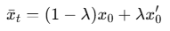
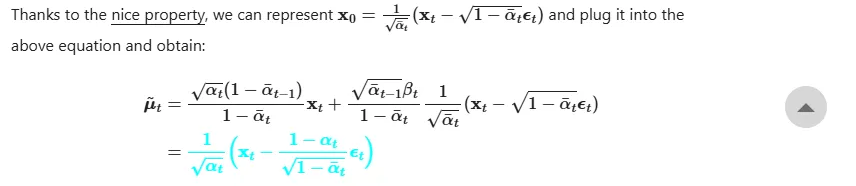

# Denoising Diffusion Probabilistic Models

Created: 2025년 8월 14일 오전 10:32

Q. 4.4에 

라고 나와있는데, 우변에도 $x_t$여야 하지 않나..?

A. 오타라고 합니다

# Introduction

VAE, GAN 등 Deep generative model들이 다양한 데이터 형태에서 높은 품질의 샘플을 생성하는 데 성공했음.

이 논문에서는 diffusion model이라는 모델을 다룰 것임.

Diffusion model : parameterized Markov chain.

점진적으로 노이즈를 더하는 Markov chain이 있고(sampling의 반대방향) 이를 역으로 되돌리는 법을 학습함. 노이즈를 더하는 것이 가우시안 분포라면, reverse 과정도 조건부 가우시안으로 설정할 수 있음.

Diffusion model은 정의하기 명확하고 학습이 효율적이지만, 지금까지는 높은 퀄리티의 sample을 얻을 수 있는지에 대한 증명을 하지 못했었다.

→ 이 논문에서 다른 생성모델들보다도 높은 퀄리티의 sample 얻어냄

또한 diffusion model의 특정 parameterization이 denoising score matching 및 annealed Langevin dynamics와 equivalence라는 것을 제시함. → 이 parameterization이 가장 높은 퀄리티의 샘플을 얻음.

하지만 다른 log likelihood-based model들에 비해 log likelihood가 높게 나오지는 않았음.

그런데 log likelihood가 높아져도 사람 눈에 거의 안 보이는 디테일들에만 영향이 감. diffusion model은 log likelihood를 높이는 대신 perceptible한 디테일에 집중함. → 사람 눈에는 더 우수한 퀼리티의 샘플

---

# Background

Diffusion model은 latent variable model.

[reverse process]

$p_\theta(x_{0:T})$ : reverse process (Markov chain). 

$p_\theta(x_{0:T}) := p(x_T) \prod_{t=1}^T p_\theta(x_{t-1} \mid x_t), \\p_\theta(x_{t-1} \mid x_t) := \mathcal{N}\!\bigl(x_{t-1}; \mu_\theta(x_t, t), \Sigma_\theta(x_t, t)\bigr).$ : transition. 

평균과 분산을 예측해야함 → 노이즈에서 원래 이미지로 복원 가능

[forward process]

Markov chain. 점진적으로 데이터에 가우시안 노이즈를 더함.

각 step 마다 더하는 노이즈의 스케일을 $\beta_t$로 조정함. (점진적으로 스케일이 커짐. 학습 가능하게 설정할 수도 있고 고정된 하이퍼파라미터로 둘 수도 있음.)

$q(x_{1:T} \mid x_0) := \prod_{t=1}^T q(x_t \mid x_{t-1}) \\ q(x_t \mid x_{t-1}) := \mathcal{N}\!\bigl(x_t; \sqrt{1-\beta_t}\,x_{t-1}, \beta_t I\bigr).$

---

$q(x_t \mid x_0)$ 를 closed form으로 나타낼 수 있음.

$q(x_t \mid x_0) = \mathcal{N}\!\bigl(x_t;\, \sqrt{\bar{\alpha}_t}\,x_0,\,(1-\bar{\alpha}_t)I\bigr)$      where  ( $\alpha_t := 1 - \beta_t, \ \bar{\alpha}_t := \prod_{s=1}^t \alpha_s$ )

- 증명
    
    
    

---

$x_0$이 주어지면 forward process posterior를 계산 가능.

- 증명
    
    가우시안임을 어떻게 아는지? → 베이즈 정리를 사용해서 적어보면 가우시안끼리 곱하고 나눴으므로.
    
    
    

→ 위의 공식을 사용해서 $x_t, \epsilon_t$에 대해서만 남길 수 있음.

---

Training 방향:

negative log likelihood 자체는 intractable하기 때문에 variational bound를 설정하여 이것을 최소화하는 방향으로 설정.

→ 조금 더 정리하면:

→ VLB (ELBO)

- 증명
    
    $L_{VLB}$ 3번째줄까지 논문 수식 (3)
    
    
    
    
    

$L_T$ : constant, 학습 때 무시 가능. (q에는 학습가능한 파라미터가 없고, $x_T$는 가우시안 노이즈.)

$L_0$ : 별도의 discrete decoder를 사용하기도 함. ( derived from $\mathcal{N}\!\bigl(x_{0}; \mu_\theta(x_1, 1), \Sigma_\theta(x_1, 1)\bigr).$

KL divergence들이 모두 가우시안 끼리의 비교이므로, 높은 분산의 Monte Carlo estimates 대신 Rao-Blackwellized 방식으로 계산 가능.

(Monte Carlo : 기댓값 계산이 불가능할 때 샘플링으로 근사하는 방법. / Rao-Blackwellized : 조건부 기댓값을 사용해서 analytic한 부분을 직접 계산하는 방법.)

---

# Diffusion models and denoising autoencoders

Diffusion model은 자유도가 큼 ( $\beta_t$ 설정, Gaussian parameterization 등…)

→ 근데 이 논문처럼 denoising score matching과 연결지으면 단순하고 잘 동작하는 objective를 얻을 수 있음. 

---

### Forward process and $L_T$

$L_T = D_{KL}\!\big(q(x_T \mid x_0) \,\|\, p(x_T)\big)$

$\beta_t$는 상수로 설정. (학습 불가능) & q에는 학습가능한 파라미터가 없음. → $L_T$는 상수. 학습 때 무시 가능.

---

### Reverse process and $L_{1:T-1}$

$L_{t-1} = \mathbb{E}_q \!\left[ D_{KL}\!\big(q(x_{t-1}\mid x_t, x_0) \,\|\, p_\theta(x_{t-1}\mid x_t)\big) \right]$

$p_\theta(x_{t-1} \mid x_t) := \mathcal{N}\!\bigl(x_{t-1}; \mu_\theta(x_t, t), \Sigma_\theta(x_t, t)\bigr)$ 에서

$\Sigma_\theta(x_t, t) = \sigma_t^2 I$ 로 설정.

- $\sigma_t^2 = \beta_t$ → $x_0$가 완전 랜덤인 가우시안일 때 적절.
- $\sigma_t^2 = \tilde{\beta}_t = \frac{1 - \bar{\alpha}_{t-1}}{1 - \bar{\alpha}_t}\,\beta_t$ → $x_0$가 deterministic한 한 점일 때 적절.

- Rmk)
    
    
    
    
    

→ 여기서 가운데 quadratic form 빼고는 theta와 무관 → 상수 C로 처리.

quadratic form을 간단히 나타내면 다음과 같음:

→ $\mu_{\theta}$를 $\tilde{\mu}_t$에 가까워지도록 학습한다는 직관에 맞음.

여기서 $\tilde \mu_t$는 위의 민트색처럼 나타낼 수 있고, 

$\mu_{\theta}$를 다음과같이 매개변수화 할 수 있음.

( 원래는 $x_t$, t로 예측. 그런데 그 두 개를 알면 $x_0$를 예측 가능하므로 $x_t, x_0$(추정값)으로 $x_{t-1}$을 예측한다고 해석 가능 )

따라서,

$$
\begin{aligned}L_{t-1} - C&= \mathbb{E}_{x_0, \epsilon} \Bigg[ \frac{1}{2\sigma_t^2}     \big\| \tilde{\mu}_t(x_t, x_0) - \mu_\theta(x_t, t) \big\|^2 \Bigg] \\[6pt]&= \mathbb{E}_{x_0, \epsilon} \Bigg[ \frac{1}{2\sigma_t^2}     \Big\| \frac{1}{\sqrt{\alpha_t}} \Big(x_t - \tfrac{1-\alpha_t}{\sqrt{1-\bar{\alpha}_t}} \epsilon \Big)     - \frac{1}{\sqrt{\alpha_t}} \Big(x_t - \tfrac{1-\alpha_t}{\sqrt{1-\bar{\alpha}_t}} \epsilon_\theta(x_t,t) \Big)     \Big\|^2 \Bigg] \\[6pt]&= \mathbb{E}_{x_0, \epsilon} \Bigg[     \frac{(1-\alpha_t)^2}{2 \alpha_t (1-\bar{\alpha}_t) \sigma_t^2}     \big\| \epsilon - \epsilon_\theta(x_t, t) \big\|^2 \Bigg] \\[6pt]&= \mathbb{E}_{x_0, \epsilon} \Bigg[     \frac{(1-\alpha_t)^2}{2 \alpha_t (1-\bar{\alpha}_t) \sigma_t^2}     \big\| \epsilon - \epsilon_\theta\!\big(\sqrt{\bar{\alpha}_t} x_0 + \sqrt{1-\bar{\alpha}_t}\,\epsilon,\, t\big) \big\|^2     \Bigg].\end{aligned}
$$

( i.e. 

→ $\mu$에 대한 예측을 노이즈 $\epsilon$에 대한 예측으로 바꿈. → loss 단순해짐 & 학습 안정적.)

---

따라서 $x_{t-1} \sim p_\theta(x_{t-1}\mid x_t)$ 를 sampling하는 식은

$x_{t-1} = \frac{1}{\sqrt{\alpha_t}} \left( x_t - \frac{\beta_t}{\sqrt{1-\bar{\alpha}_t}}\, \epsilon_\theta(x_t, t) \right) + \sigma_t z, \quad z \sim \mathcal{N}(0, I)$

이렇게 적을 수 있음.

그리고 이건 (annealed) Langevin dynamics와 동일한 형태로 볼 수 있음.

x를 샘플링하기 위해 경사 상승 + 가우시안 노이즈를 반복하는 것처럼, $x_0$를 샘플링하기 위해 똑같은 과정을 반복한다고 볼 수 있음. (그런데 스케줄이 점점 줄어드니까 anneald Langevin dynamics 라고 부름.)

---

또한, (12)를 Denoising Score Matching loss로 해석할 수도 있음.

score function 정의 : 

원래 분포를 모르니 대신 score function을 구해서 원래 분포를 알아내자. → score matching

(score function을 알면 원래 분포가 어떻게 생겼는지 알 수 있음.)

그리고 noise가 낀 데이터를 바탕으로 score matching을 수행하면 Denoising score matching이라고 부름.

→ (12)가 결국 DSM loss의 형태임.

핵심 정리:

Introduction에서 말했던 동치 관계.

→ 하지만 이렇다고 해서 성능이 뛰어나다는 게 증명되는 건 아니므로 noise 예측과 $\tilde \mu_t$예측에 대한 ablation 연구 결과를 제시함.

---

### Data scaling, reverse process decoder, and $L_0$

원래 이미지 픽셀값은 {0,1, …, 255} → [-1, 1]로 선형 변환해서 처리.

[training]

실제 $x_0$는 이산적인 값. → discretized Gaussian likelihood 사용.

가우시안 분포를 픽셀값 근처의 작은 구간에 대해서 적분.

i : 각 차원. 

[sampling]

$x_0$를 모름 → 적분 없이 그냥 학습했던 $\mu_{\theta}$ 출력. ( [0, 255]로 rescale하고 반올림 해서 이산 픽셀 값으로 출력 )

그런데 실제 학습에서는 이산 가우시안 계산 안 하고 score matching 기반 MSE loss로 단순화해서 계산함. 이론적으로는 이런데 단순화 가능 .. 이라고 생각하면 될 듯.

(introduction에 나왔던 lossless codelength가 (12), (13)을 의미함. 이걸 단순화해도 사람 눈에 보이지 않는 디테일에만 영향이 가기 때문에 우리가 보기에 퀄리티에 지장은 없음(오히려 사람 눈에는 더 퀄리티가 더 좋아보임). but likelihood가 낮을 수는 있음.)

---

### Simplified training objective

위에서 계산한 (12), (13)은 미분가능하고 학습에 그대로 적용 가능. 하지만 더 단순화 가능.

t는 1~T의 값을 uniform 분포로 뽑은 것. 

t=1의 경우가 $L_0$의 (13)에 해당. (원래 다른 꼴이었지만 계산을 해보면 같은 꼴로 정리된다고 함.)

t>1의 경우는 (12)의 unweighted version.

이 단순화된 loss는 NCSN(Noise Conditional Score Network)랑 같은 꼴임. (모든 노이즈 레벨 t에서 score predictoin MSE를 평균내는 방식.)

→ denoising score matching과 동치라는 걸 다시 한 번 더 언급한 듯.

따라서 training 및 sampling 과정을 위와 같이 정리 가능.

training 과정을 $x_0, \epsilon, t$에 대한 SGD로 해석 가능.

(14)는 (12)에 있던 가중치를 버렸기 때문에, 다른 측면을 강조하는 weighted variational bound임.

원래 loss인 (12)는 작은 t에 해당하는 loss 항들에 weight를 더 줌.

작은 t에 해당하는 loss 항들은 ‘아주 약간의 노이즈만 포함된 데이터’를 복원하는 훈련을 시키는데, 이 경우는 너무 쉽기 때문에 덜 중요하게 만드는 것이 합리적임.

→ 따라서 (12) 대신 (14)를 사용하면 모델이 더 큰 t (강한 노이즈가 들어간 데이터)에서의 denoising을 학습하는 것에 집중할 수 있기 때문에 샘플 퀄리티가 향상됨.

- (12)의 weight term 그래프
    
    
    

---

# Experiments

- T = 1000
- $\beta_1 = 10^{-4}, \beta_T = 0.02$. 선형적으로 증가하도록 설정. → 이렇게 하니까 $L_T \;=\; D_{\mathrm{KL}}\!\bigl(q(x_T \mid x_0)\,\|\,\mathcal{N}(0,I)\bigr) \;\approx\; 10^{-5}$ 정도로 나옴. 최종 $x_T$가 거의 온전한 가우시안 노이즈에 가까워서 reverse process가 순수한 노이즈에서 시작될 수 있음.
- reverse process로는 U-Net backbone을 사용. GroupNorm 적용. (이미지를 받아서 노이즈 예측)
- parameter들은 time 간에 공유되고 sinusoidal positional embedding 적용해서 t를 벡터로 변환.
- 16 x 16 크기의 feature map에서는 self-attention 수행.

---

### Sample quality

→ CIFAR10 results.

IS : 높을수록 좋음 / FID : 낮을수록 좋음.

NLL은 simple loss로 학습한 결과를 다시 기존의 loss로 계산한 값.

Unconditional 모델로 당시 SOTA 수준

---

### Reverse process parameterization and training objective ablation

true variational bound에서 학습하는 것이 simplified objective에서 학습하는 것 보다 likelihood(codelength)는 높음. 그러나 sample quality는 후자가 더 좋았음.

$\tilde \mu$ 학습은 원래 variational bound에 대해서만 학습이 잘 됐음.

분산 학습은 오히려 성능 저하.

simple Loss로 노이즈 MSE 하는 게 가장 샘플 퀄리티가 좋았음.

---

### Progressive coding

CIFAR10 데이터셋에서 train/test NLL 차이가 최대 0.03 → overfitting 아님.

에너지 기반 모델 등에 비하면 NLL이 낮지만 다른 likelihood 모델에 비해 NLL 수치가 높음. → lossless 압축 성능은 부족.

하지만 샘플 퀄리티는 좋음. → diffusion 모델은 lossy compressor (손실 압축기)로 해석할 수 있음. (눈에 보이는 정보는 잘 살리고, 눈에 안 띄는 디테일은 버림.)

이를 Rate-Distortion (정보량 - 손실)로도 해석할 수 있음.

→ $L_{1:T}$는 rate(데이터를 무손실로 재현하려면 추가로 전송해야 하는 정보량) / $L_0$는 distortion (모델이 원본과의 차이를 설명하는 데 필요한 비트)

$L_0$가 1.97 정도인데 이는 0~255 scale에서 1정도에 해당하는 오차. → 사람 눈에 거의 보이지 않음.

따라서 likelihood가 조금 낮지만 샘플 퀄리티는 좋음.

---

**Progressive lossy compression**

Progressive lossy compression : 데이터를 순차적으로 전송·복원하면서, 처음엔 대략적(왜곡 있음)으로, 점점 더 많은 비트를 쓰면서 눈에 보이는 품질을 개선하는 손실 압축 방식.

t = T에서는 완전한 노이즈 상태 → distortion 매우 큼.

t가 줄어들수록 (더 많은 비트 전송) → 원본과 점점 가까워짐.

마지막에 $x_0$복원 → distortion 최소.

rate와 distortion의 관계를 그래프로 그려보면 다음과 같음.

세 번째 그래프를 보면, 낮은 rate 구간에서 distortion이 가파르게 감소하고 높은 rate 구간에서는 distortion 감소가 완만해짐.

→ 적은 비트만 전송해도 이미지의 perceptible한 정보는 거의 다 복원됨. & 추가적인 비트들은 사실상 imperceptible distortions을 맞추는 데 쓰임.

---

**Progressive generation**

Progressive generation : reverse process를 따라가면서 한 단계씩 노이즈를 걷어내는 과정.
random bit로부터의 progressive decompression으로 볼 수 있음.

원래는 한 단계씩 거쳐가며 원본을 복원하지만, 위의 식을 사용해서 언제든지 각 t에서의 $x_0$을 예측 가능.

t가 클 때는 대략적인 구조만 보이고 디테일은 없음. $x_0$을 바로 예측해봐도 대략적인 구조만 유사하게 복원됨.

t가 작을 때는 거의 다 원본과 유사하고 디테일 손실만 조금 있음.

→ conceptual compression과 연결 : 정보량을 줄여도 본질적 개념(큰 구조, 의미)은 남고, 세세한 픽셀 노이즈는 버려짐.

---

**Connection to autoregressive decoding**

variational bound를 다음과 같이 변형할 수 있음.

- 증명
    
    
    

그리고 T를 데이터 차원 수와 동일하게 설정하고, t번째 step에서는 1~t번째 좌표가 마스킹되도록 설정.

→ 그러면 autoregressive decoding 과정으로 볼 수 있음.

즉, qutoregressive 모델도 diffusion 모델의 특수한 케이스로 볼 수 있음.

또한 일반 가우시안 diffusion도 일종의 autoregressive로 해석할 수 있음.

(일반 autoregressive 모델이 좌표 순서를 하나 정해서 그 순서대로 학습한다면, diffusion은 매 단계에서 모든 좌표에 노이즈를 조금씩 추가하는 방식.)

autoregressive 모델과는 달리 자연스러운 가우시안 노이즈를 쓰기 때문에 inductive bias의 효과가 커져서 샘플 품질이 더 좋아질 수 있음.

그리고 가우시안 diffusion의 길이 T는 데이터 차원과 같을 필요가 없음.

샘플링 속도를 빠르게 하기 위해 짧게 설정할 수도, 표현력을 늘리기 위해 길게 잡을 수도 있음.

---

### Interpolation

원래 두 이미지를 픽셀 별로 선형 보간하면 이상하게 보임.

→ 대신 두 이미지의 잠재표현($x_t$)에서 선형보간한 다음 reverse process를 통해 복원시키면 두 이미지를 적절히 섞은 이미지가 나옴.

t를 크게 설정할수록 큰 구조만 남고 디테일은 사라짐 → 더 다양한 보간. 

t=1000으로 설정할 경우 새로운 샘플이 나오기도 함.

---

# Related Work

Flow나 VAE와는 달리 diffusion은 q에 파라미터가 전혀 없도록 설계되어 있고, $x_T$와 $x_0$사이의 상호 정보량이 0에 가까움.

이 논문의 reverse process (노이즈 예측)은 diffusion 모델을 여러 noise level에서의 denoising score matching 및 annealed Langevin dynamics과 연결시킴.

그러나 단순 score matching 기반 모델(NCSN 등)은 likelihood 계산이 불가능하지만, diffusion은 log likelihood 계산 가능.

Score matching과 EBM(energy-based modeling)은 연결점이 있기 때문에, 이 연구가 EBM 연구에도 영향을 줄 수 있음.

diffusion의 rate-distiortion curve 계산 방식이 annealed importance sampling에서의 curve 계산 방식과 비슷함.

progressive decoding 아이디어는 convolutional DRAW 등의 모델에서도 볼 수 있으며, 이는 autoregressive 모델의 subscale ordering (픽셀 순서를 정하는 방법)이나 샘플링 전략을 위한 더 일반적인 설계로 이어질 수 있음.

---

# Conclusion

이 논문은 diffusion 모델을 사용해서 높은 품질의 이미지 샘플을 제시했으며, diffusion model과 다음 사이의 연결들을 찾아냄:

- variational inference for training Markov chains
- denoising score matching
- annealed Langevin dynamics
- EBM
- autogressive models
- progressive lossy compression

diffusion은 이미지 데이터에 대해 뛰어난 inductive bias를 가지고 있는 것처럼 보임. 

→ 다른 데이터(오디오, 텍스트 등)나 다른 종류의 생성 모델 혹은 머신러닝의 구성 요소로서의 유용성을 연구해볼 예정.