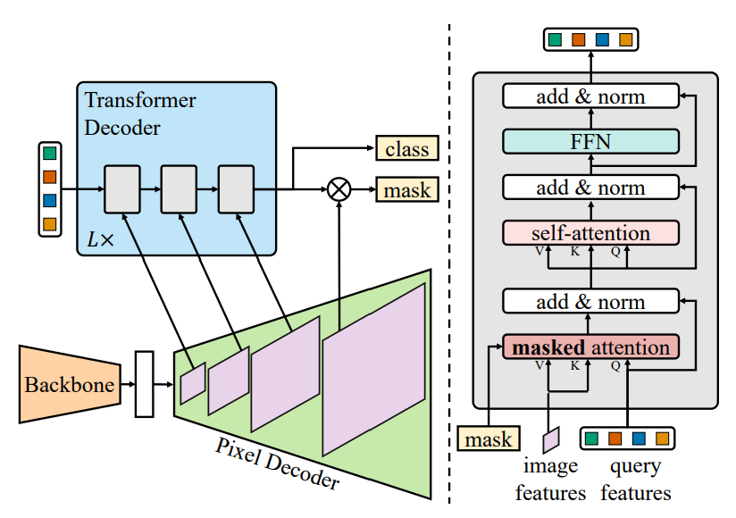

# Masked-attention Mask Transformer for Universal Image Segmentation

Created: 2025년 8월 2일 오후 3:14

# Introduction

segmentation에는 semantic, instance, panoptic이 있음.

semantic : 각 픽셀이 어떤 종류의 물체인지 판별

instance : semantic에서 서로 다른 개체를 구별.

panoptic : semantic + instance. 배경에는 semantic, 개체들에는 instance 방식 적용.

이것들은 모두 유사한 작업이지만 기존 연구에서는 각 task에 맞는 specialized된 모델들이 주로 개발됐음.

→ 다른 task에 일반화될 수 있는 유연성 부족.

그래서 Maskformer같이 다양한 segmentation task에 적용할 수 있는 모델들이 생겨났지만, 여전히 각 task에 대해 specialized된 모델들에 비해서는 성능이 떨어졌음. & 계산량도 더 많음.

본 연구에서는 Mask2Former(Masked-attention Mask Transformer) 라는 모델을 제시.

→ universal architecture이면서도 specialized 모델들보다도 성능이 좋음.

이 모델에서 사용된 핵심 아이디어들은 :

1. masked attention : attention의 범위를 제한
2. multi-scale high-resolution features : 작은 개체나 영역을 판별하는 데 도움을 줌.
3. optimization improvements : self attention과 cross attention 순서 바꾸기, query feature를 학습 가능하게 만들기, dropout 제거 등…
4. calculating mask loss on few randomly sampled points : 학습 memory를 많이 줄일 수 있음.

이 모델 하나로 각 segmentation task들에 대해 각각 SOTA 수준 달성.

# Related work

semantic segmentation : 

주로 픽셀 단위로 분류 작업을 수행함. (FCN-based architectures)

instance segmentation : 

주로 mask classification-based. set of binary mask들을 예측함. (Mask R-CNN)

panoptic segmentaition : 

semantic + instance. 두 task의 best 모델을 합치기도 하고 semantic region과 instance object를 같이 취급하는 새로운 목적함수를 만들기도 함. panoptic segmentation 모델은 다른 task에서는 좋은 성능을 보이지 못함.

universal architecture :

DETR : mask classification. transformer와 set prediction 사용. 모든 segmentation task에 일반적으로 적용 가능.

MaskFormer : DETR의 발전형? panoptic 뿐만 아니라 semantic segmentation에서도 SOTA 달성.

K-Net : instance segmentation까지 확장.

하지만 이런 모델들은 각 task에 specialized된 model들 보다는 성능이 낮았음.

→ Mask2Former가 이걸 극복해냄.

# Masked-attention Mask Transformer

Mask2Former 모델 구조 소개.

## Mask classification preliminaries

Mask2Former는 기본적으로 Mask classification 구조를 따름.

Mask classification architecture : N개의 binary mask를 예측함으로써 픽셀들을 N개의 segment들로 그룹지음.

각 segment들은 C-dimensional feature vector(”object query”)로 표현됨. 그리고 이것들은 Transformer decoder를 거치게 됨. (DETR의 구조를 가져온 것.)

meta architecture는 다음과 같은 구조를 가짐:

1. backbone : 이미지로부터 low-resolution feature들을 추출함. (1/32, 1/16, 1/8, 1/4 사이즈)
2. pixel decoder : low-resolution feature들을 MSdeformattn을 통해 upsample함. → high-resolution per-pixel embedding 생성.
3. Transformer decoder : image feature들을 사용하여 object query를 계산함.
4. 최종 binary mask prediction은 finest resolution per-pixel embedding(1/4 크기)과 object query들의 내적 ( 한 번에 수행하니 사실상 행렬곱 ) 으로 계산됨.

       최종 class prediction은 object query를 affine layer에 통과시켜 계산.

## Transformer decoder with masked attention

Mask2Former는 위의 meta architecture를 적용했지만, Transformer decoder의 약간의 변형을 가했음. 

→ “masked attention operator” : 전체 feature map에 대해 attention을 수행하는 것이 아니라, ‘foreground region’(해당 segment의 mask에 해당하는 위치)에 대해서만 attention 수행. 

feature pyramid(다양한 크기의 feature map)을 순차적으로 transformer decoder layer에 입력해줌. (round-robin)

### Masked attention

image segmentaion에서 context feature(주변 상황, 맥락을 나타내는 feature)는 중요함.

그러나 최근 연구들은 transformer-based 모델들의 느린 수렴이 전역적 context 때문이라고 지적함. 국소적 object region에 attend하기까지 시간이 오래 걸리기 때문.

→ 본 논문에서는 query feature들을 업데이트 하기 위해서는 local feature만으로 충분하고, context 정보는 self-attention을 통해 얻을 수 있다고 가정함.

→ “masked attention” : 각 predicted mask의 foreground region에 대해서만 cross-attention 수행.

→ 기존 cross-attention + residual path 수식.

→ masked attention 수식.

기존 cross-attention에다가 attention mask 추가. 이전 layer에서 (x,y)의 score가 threshold 미만이었다면 softmax값이 0으로 나오도록 처리.

input image features들이 크기가 다 다르기 때문에 추가적으로 resize (interpolation) 과정을 적용해줌.

$M_{l-1} : N \times H_lW_l$  형상. N개의 segment 별로 HW (image features 픽셀? 개수) 개의 값을 가짐.

### High-resolution features

High-resolution feature는 작은 object들을 잘 판별하도록 도와줌. 그러나 계산량이 늘어남.

→ 계속 high-resolution feature를 유지하지말고, ‘feature pyramid’ 방식을 사용.

feature pyramid : backbone에서 생성된, 원래 이미지의 1/32, 1/16, 1/8 사이즈에 해당하는 resolution을 round-robin 방식으로 transformer decoder에 넣어줌.

각 resolution마다 sinusoidal postional embedding과 learnable scale-level embedding을 더해줌.

scale-level embedding : 1 x C 형상의 벡터. 이 feature가 어떤 scale(해상도)에서 왔는지에 대한 정보. HW번 브로드캐스팅 되어 더해짐. 

1/32, 1/16, 1/8 해상도가 한 묶음. 총 L번 반복. → 총 3L 개의 layer.

round-robin 방식으로 각 layer에 image feature 입력해줌.

### Optimization improvements

[기존 Transformer decoder]

- self-attention → cross-attention → FFN
- query feature는 0으로 초기화됨. 여기에 learnable positional embedding만 더해서 초깃값으로 입력됨. 그리고 최종 출력에 대한 loss의 gradient만 적용되어 업데이트됨.
- dropout 적용.

[Mask2Former의 Transformer decoder]

- cross-attnetion(masked attention) → self-attention → FFN (self-attention을 먼저 수행하게 되면, 그때의 query feature는 image에 대한 정보를 충분히 담고 있지 않으므로 정보 교환이 잘 일어날 수가 없기 때문.
- query feature를 learnable하게 설정하고 초기 predicted mask($M_0$) 에 대해서도 따로 loss 계산. → 처음부터 mask를 꽤 그럴듯하게 맞힐 수 있음. 마치 region proposal network처럼 동작.
    
    
    
- dropout이 오히려 성능을 저하시킴. dropout 제거.

## Improving training efficiency

universal architecture 학습의 문제점 : high-resolution mask prediction 때문에 매우 큰 메모리가 필요함.

→ 모든 픽셀을 사용하지 말고 matching loss 와 final loss 계산 시에 각각 uniform / importance sampling을 수행.

각 loss 계산 시에는 보통 Dice loss와 BCE (Binary cross-entropy) loss 를 혼합해서 사용. (가중치합)

BCE와 Dice의 수식. 이것은 Dice coefficient고, Dice loss 는 보통 (1 - Dice coefficient) 로 사용.

matching loss :

우리가 예측하는 mask의 개수는 보통 넉넉하게 잡음. (100개 정도) 그리고 실제로 이미지에 존재하는 segment의 개수는 이미지마다 다 다르고, 보통 100개보다는 적음.

mask를 예측하고 난 후, 우리가 예측한 mask를 GT mask에 1:1 대응시켜주고 남은 것들은 background, no object 등으로 버림.

여기서 1:1 대응, 즉 이 mask가 어떤 segment를 나타내는지를 판별하고자 하는 게 matching loss. 

이 때는 K개의 점들을 uniformly sampling 해서 loss 계산에 사용. 이때 계산한 loss는 gradient는 따로 계산 x

GT mask마다 가장 유사한 predicted mask를 대응시킴.

final loss :

matching loss를 계산해서 각 예측 mask와 GT mask를 대응시킨 후 mask별로 예측을 얼마나 잘했는지 판별하기 위한 loss.

여기서는 importance sampling을 수행. (중요도가 큰 점들을 우선적으로 선택함)

여기서 중요도는 다음과 같이 계산함 :

→ mask 값이 0.5에 가까울 수록 중요도가 큼. (경계 근처일수록, 예측에 확신이 없을 수록 중요)

중요도를 정규화하여 확률값으로 본 뒤 sampling하기도 하고 top-K 방식으로 선택하기도 함.

여기 loss 계산에도 BCE와 Dice loss 혼합 사용.

추가적으로 각 mask가 class를 잘 예측했는지에 대한 classification loss도 더해준다고 함.

이렇게 sampling을 통해 메모리를 약 3배정도 절약할 수 있음.

# Experiments

Dataset : COCO, ADE20K, Cityscapes, Mapillary Vistas 사용. 

## Implementation details

[Pixel decoder]

MaskFormer에서는 simplicity를 위해 FPN을 사용했었는데, Mask2Former에서는 좀 더 성능을 높이기 위해 MSDeformAttn을 사용.

backbone에서 나온 1/32, 1/16, 1/8 사이즈의 feature map을 가지고 6개의 MSDeformAttn layer를 거쳐 1/8 사이즈의 정제된 feature map 출력

→ 1/4 사이즈로 upsampling + lateral connection 더해줌 (backbone에서 만들어진 1/4 사이즈의 feature map을 1x1 conv 해준 것.)

→ 이것이 high-resolution per-pixel embedding. 최종 mask 예측에 사용됨.

[Transformer decoder]

L = 3. (총 9개의 layer)

#query = 100

각 transformer decoder layer 출력과 learnable query feature 초깃값에 대해 auxiliary loss 추가.

(predicted mask들 모두에게 supervision 적용해주겠다는 뜻)

[Loss weight]

Mask loss : 

$L_{mask} = \lambda_{ce}L_{ce} + \lambda_{dice}L_{dice}$ 

$\lambda_{ce} = \lambda_{dice} = 5.0$

final loss :

$L_{final} = L_{mask} + \lambda_{cls}L_{cls}$

$\lambda_{cls}$는 GT mask에 해당하는 예측에 대해서는 2.0, ‘no object’에 대해서는 0.1 사용.

[Post-processing]

각 object query마다 binary mask, class prediction을 예측함. → 이 둘로 최종 segmentation map을 만들기 위해 후처리가 필요함.

Maskformer에서 했던 방식 가져옴.

그런데 instance segmentation도 잘 처리해야 하므로 class confidence와 mask confidence를 곱해서 최종 confidence를 계산해줌.

binary mask + class prediction 조합으로 전체 픽셀에 대해 label 할당.

마스크가 겹치는 픽셀이 있을 경우 confidence가 높은 mask 우선.

각 pixel에 대해 가장 확률이 높은 mask/class 조합으로 설정.

## Main resluts

성능 평가 결과.

PQ : panoptic / AP : instance / mIoU : semantic segmentation 용 metric.

전반적으로 훨씬 낮은 에폭으로 SOTA수준 이상 달성.

## Ablation studies

masked attention을 없앴을 때 가장 성능이 떨어짐. → masked attention이 매우 중요한 역할을 함.

그 다음은 high-resolution features.

efficient multi-scale strategy가 성능에는 영향 없이 FLOPs를 꽤 줄여주는 것 확인. 

loss를 mask 전체가 아닌 몇몇 point 들에 대해서만 계산해주는 것도 성능에 영향 없이 약 3배 정도 메모리를 절약시켜준다는 것 확인.

Learnable query가 Region proposal 처럼 동작. 처음부터 꽤나 잘 예측함.

## Generalization to other datasets

다른 데이터셋에 대해서도 SOTA 수준 달성. 

→ 데이터셋에 대해서도 일반화 성능 좋음.

## Limitations

연구진들의 최종 목표는 모든 image segmentation task를 잘 처리할 수 있는 ‘single’ model을 만드는 것이었음.

그러나 panoptic segmentation에 대해서 학습된 Mask2Former가 instance나 semantic segmentation task에 대해서 학습된 Mask2Former가 해당 task (instance or semantic)에 대해서 성능이 약간 낮았음.

→ 그래서 결국 각 task에 대해 따로따로 학습을 해줘야 최고 성능이 나옴.

→ 딱 한 번만 학습하면 모든 task에 대해 최고의 성능을 내는 모델을 만드는 것이 future work.

추가적으로, Mask2Former는 작은 object들을 처리하는 데 어려움을 겪는 모습을 보임.

# Conclusion

masked attention을 핵심 구조로 적용한 Mask2Former라는 universal image segmentation 모델을 개발함.

다양한 segmentation task에 대해 SOTA 수준 달성.