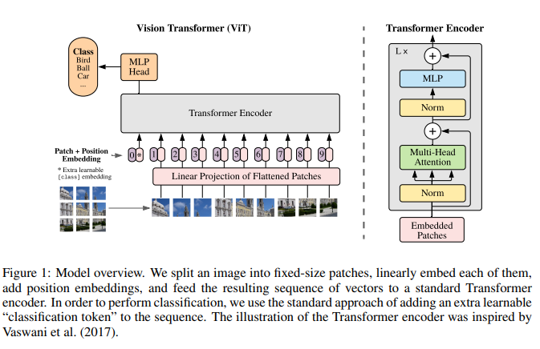

# An Image is Worth 16x16 Words: Transformers for Image Recognition at Scale

Created: 2025년 7월 25일 오후 12:51

# Introduction

Self-attention 을 베이스로 한 Transformer는 NLP 분야에서 대표적인 모델로 자리잡음.

Transformer의 효율성과 확장성 덕분에 매우 큰 모델도 train 할 수 있게 되었고, 모델 크기나 데이터셋을 늘려도 성능이 포화되지 않고 계속 향상되고 있었음.

→ 그러나 CV 분야에서는 여전히 Convolutional architecture가 주류로 남아있었음. 

CV 분야에도 attention을 적용하려는 연구는 있었지만, 여전히 large-scale 이미지 분야에서는 클래식한 ResNet-like 아키텍쳐가 최첨단이라고 볼 수 있었음.

→ 본 연구진은 최소한의 수정만 거치고 transformer 를 직접적으로 이미지에 적용하는 연구 수행. 

→ 이미지를 patch들로 나누고 sequence of linear embeddings of patches를 Transformer의 입력으로 제공. 여기서 이미지 patch들은 NLP의 token과 같은 방식으로 다뤄짐. 

→ 그러나 ImageNet같은 mid-sized dataset으로 학습했을 때, 이 모델은 ResNet보다 살짝 낮은 성능을 보임. 이는 CNN과 달리 transformer에는 inductive bias가 부족하고 (locality, translation equivariance) 따라서 충분하지 않는 양의 데이터로는 이런 특성을 스스로 학습할 수 없기 때문.

→ 하지만 충분히 큰 dataset(14M-300M images)으로 학습을 하면 large scale training이 inductive bias의 영향을 뛰어넘어서 우수한 성능을 내게 됨. ViT는 대규모 데이터셋에서 pre-train을 하고 이후 소규모 데이터셋으로 전이학습하는 방식으로 SOTA수준을 달성했음.

# Related Work

NLP 분야 : Transformer—based model : BERT, GPT

이들은 pre-training → fine-tuning 구조를 따름.

CV 분야 :

각 픽셀에 대해 attention 수행? → cost가 픽셀 개수의 제곱에 해당함. 사실상 불가.

주변 픽셀에 대해서만 어텐션 수행, 다양한 크기의 블록에 대해 어텐션 수행 → 복잡한 engineering 필요.

 2x2 image patch 추출 → ViT와 유사. but ViT는 small-resolution 뿐만 아니라 medium-resolution image들도 잘 처리 가능.

한편, CNN + self-attention을 적용한 연구도 다양함.

iGPT : 이미지 해상도와 색상 차원을 줄이고 transformer 사용. 비지도학습, 생성모델.

large scale dataset에 대한 연구도 많음.

대표적으로 ImageNet-21k, JFT-300M과 같이 large scale dataset에 대해 CNN으로 전이학습을 수행한 연구.

→ ViT도 이 두 데이터셋에 집중. 하지만 ResNet-based 모델 대신 transformer를 학습시켰다는 차이점이 있음.

# Method

### Vision Transformer(ViT)

Transformer에서 token embedding의 1D sequence를 입력으로 주었던 것과 비슷하게 처리함.

$\mathbf x \in \mathbb R^{H \times W \times C}$  →  $\mathbf x_p \in \mathbb R^{N \times (P^2 \times C)}$  변환. (이미지를 패치들로 변환)

$N = HW/P^2$ (이미지의 픽셀 개수를 패치 하나의 픽셀 개수로 나눈 것) = (패치 개수)

$N$은 트랜스포머 모델의 시퀀스 길이에 해당함.

$\mathbf x_p \in \mathbb R^{N \times (P^2 \times C)}$ 를 $N \times D$ 차원으로 linear projection 해줌. → “patch embeddings”

BERT의 [class] token 아이디어 적용.

시퀀스 맨 앞에 $\mathbf x_{class}$( $= z_0^0$) 추가. 이 토큰이 이미지의 전체 정보를 요약할 수 있도록 학습됨.

이 위치에 해당하는 Transformer encoder 최종 출력 $z^0_L$ (L번째 layer의 첫번째 토큰 출력)은 LayerNorm을 거쳐  image representation $\mathbf y$를 도출함.

$\mathbf y$는 pre-training 시에는 MLP with one hidden layer, fine-tunning 시에는 single linear layer를 거쳐 최종 출력을 계산함.

(+)다른 토큰들도 전체 정보를 요약할 수 있을 텐데 왜 굳이 class token을 따로 두는가?

→ 이미지의 전체 정보가 class token이라는 ‘일관된 위치’로 집중되도록 학습 가능.

     전체 patch의 평균으로 전체 정보를 도출하는 등의 다른 방법들도 있지만, class token을 설정하는 게 가장 간단하면서도 성능이 준수함. 또한 BERT에서 검증된 방식이기 때문에, 최소한의 수정만 거치겠다는 ViT의 목표에도 적합함. 

learnable 1D position embedding 더해줌.

learnable 방식을 쓰는 이유?

→ transformer에서는 시퀀스 길이가 가변적이었기 때문에 sinusoidal 방식 사용. 그러나 ViT에서는 시퀀스 길이가 고정이기 때문에 learnable 방식 적용이 용이함. sinusoidal보다 더 정교한 표현이 가능하고 실험적으로도 좋은 성능을 보임.

Transformer encoder 내부 구조는 원래 transformer의 encoder와 비슷하지만 layernorm의 위치가 다름.

Pre-LN 구조가 학습이 안정적이고 수렴이 빠름.

<ViT 수식 정리>

여기서 최종 출력은 MLP 또는 single linear layer를 거쳐서 결정됨.

MLP의 활성화함수로는 GELU 사용.

<GELU(Gaussian Error Linear Unit)>

$$
\text{GELU}(x) = x \cdot \Phi(x)
\quad
\text {where} \ \Phi(x) = \frac{1}{2} \left(1 + \text{erf}\left(\frac{x}{\sqrt{2}}\right)\right)

$$

$$
\\
\text{GELU}(x) = \frac{x}{2} \left(1 + \text{erf}\left(\frac{x}{\sqrt{2}}\right)\right)
$$

$\Phi(x)$ : 표준정규분포의 누적분포함수(CDF)

GELU는 0에서 미분 가능, 학습 안정성.

GELU : y=x를 반영할건데 x가 클수록 많이, x가 작을수록 적게 반영하겠다.

### Inductive bias

ViT는 CNN에 비해 image-specific inductive bias가 매우 적음.

CNN은 다음과 같은 성질을 가짐 :

locality (지역적. 입력의 일부분만 봄. CNN filter의 작동방식 생각하면 될듯.)

two-dimensional neighborhood structure (2차원 이웃 구조)

translation equivariance(평행이동 등가성. 입력이 평행이동 되었을 때 출력도 똑같이 이동하는 것.)

반면 ViT는 그렇지 않음. 

MLP layer는 local & translationally equivariant 하지만, self-attention은 global하게 작동함.

2차원 관계 구조는 제일 처음 patch로 자를 때, 그리고 fine-tuning 시에 position embedding을 보정해줄 때만 사용됨.

ViT는 CNN에 비해 훨씬 적은 inductive bias를 가지고 있으며 대신 더 많은 데이터를 줘서 모델이 스스로 학습하게끔 함. **inductive bias vs. data scale의 trade-off 구조.**

(CNN은 ViT만큼 데이터 스케일 확장의 이득을 많이 얻지 못함.)

### Hybrid Architecture

CNN + ViT 구조.

CNN의 feature map을 입력 시퀀스로 사용함.

( $H\times W\times C$ 차원을 $\frac{HW} {P^2} \times P^2 C = N \times P^2C$ 차원으로 변환. )

특별한 케이스로 $P=1$로 설정할 수도 있음.

Hybrid Architecture에서도 classification input embedding이나 position embedding은 원래대로 적용됨.

### Fine-tuning and higher resolution

일반적으로 큰 데이터셋에서 pre-train하고, 이후 작은 downstream task에서 fine-tuning을 함.

fine-tuning 때는 pre-trained된 prediction head를 없애고 대신 zero-initialized 된 $D \times K$ feedforward layer를 붙여줌. ($K$ : downstream task의 class 수)

또한 일반적으로 fine-tuning 시에는 pre-train 때 보다 더 높은 해상도의 이미지를 사용하는 게 좋음.

그런데 해상도가 달라지게 되면 시퀀스 길이가 달라짐. ( $HW / P^2$ 이므로. )

→ transformer encoder 자체는 문제 없지만, position embedding의 차원이 맞지 않게 됨.

→ 기존 pre-trained된 position embedding을 새로운 해상도에 맞춰 보정해줌.

( 여기서 patch를 자르는 과정과 position embedding 보정하는 부분만 2D 구조 특성을 활용함. )

 

# Experiments

ResNet, ViT, Hybrid 모델의 representation learning 능력을 평가함.

ViT는 더 낮은 비용으로도 대부분의 벤치마크에서 SOTA 수준 달성. 또한 self-supervised learning 에서도 미래 가능성이 크다는 것을 볼 수 있었음.

## Setup

### Dataset

pre-train 용 large dataset :

- ILSVRC-2012 ImageNet dataset (1k classes, 1.3M images) (=ImageNet)
- ImageNet-21k (21k classes, 14M images)
- JFT (18k classes, 303M high-resolution images)

benchmark task :

- ImageNet
- ImageNet on the cleaned-up ReaL labels
- CIFAR-10/100
- Oxford-IIIT Pets
- Oxford Flowers-102
- VTAB

### Model Variants

ViT :

표기 예시) ViT-L/16 : Large variant with 16 x 16 input patch size.

patch size가 작아질수록 sequence 길이는 증가. → 계산 비용 증가.

Baseline CNN : ResNet(BiT) ( ResNet에서 BN → GroupNorm으로 교체 & standardized conv 도입.)

Hybrid : ResNet50의 중간 feature map을 flatten하여 sequence로 사용 (patch size = 1 x 1로 설정)

### Training & Fine-tuning

Training :

- Optimizer : Adam ( $\beta_1 = 0.9, \beta_2 = 0.999$ )
- Batch size : 4096
- Weight decay : 0.1
- Linear learning rate warmup & decay 사용

Fine-tuning :

- Optimizer : SGD with momentum
- Batch size : 512
- Polyak Averaging 사용 ( factor = 0.9999 )

### Metrics

Fine-tuning accuracies : 모델 전체를 각 benchmark task에 맞춰 다시 학습. 성능이 좋지만 시간이 오래 걸림.

Few-shot : transformer encoder의 출력까지는 고정하고 그 뒤에 붙는 MLP만 새로 학습. 성능은 보통 낮지만 계산 비용이 적고 빠름.

## Comparison to state of the art

ViT 기반의 모델이 기존 모델과 비교했을 때 연산량이 매우 적음에도 더 좋은 성능을 기록함.

학습 데이터셋의 크기가 커졌을 때( ImageNet-21k → JFT ) 성능이 더 올라가는 모습을 보임.

VTAB task들에 대해서도 대부분 BiT보다 높은 성능을 기록했으며, Specialized task 분야에 대해서만 비슷한 수준의 성능을 기록함.

## Pre-training data requirements

dataset size의 영향을 알아보기 위해 두 가지 실험 진행.

1. 모델들을 size가 다른 데이터셋들에 대해 pre-train 이후, 성능 비교. (regularization 적용)

→ ImageNet, ImageNet-21k 정도로 데이터셋 크기가 충분히 크지 않을 경우 ViT가 BiT보다 성능이 낮았고, ViT-L이 ViT-B보다 성능이 낮은 현상도 관측됨. (모델 크기가 크지만 성능은 더 낮음 → 과적합 가능성.)

그러나 JFT-300M 수준으로 데이터셋 크기가 충분히 클 경우 ViT가 BiT보다 성능이 좋았음. 그리고 이때는 크기가 큰 ViT 모델일수록 더 성능이 좋았음.

1. JFT-300M의 크기가 다른 subset들로 pre-train. 

(같은 하이퍼파라미터 사용, regularization 적용 x. 정규화의 영향을 배제하고 모델 자체의 일반화 능력만 비교하려는 목적. few-shot accuracy로 평가 진행.)

→ 작은 데이터셋에서는 BiT > ViT. 큰 데이터셋에서는 ViT > BiT. 

BiT는 데이터셋 크기가 일정수준에 다다르면 더이상 눈에띄는 성능 향상을 보이지 못함.

결론 : 

Convolutional inductive bias는 small-data에는 도움을 줌. 

하지만 big-data에서는 inductive bias 없이 데이터의 관계를 스스로 파악하는 ViT가 더 높은 성능을 보임.

## Scaling study

JFT-300M 데이터셋을 바탕으로 모델별 계산 비용 대비 성능을 평가.

결과:

1. ViT가 ResNet보다 계산비용 대비 성능이 훨씬 좋음.
2. Hybrid model은 크기가 작은 모델에서는 ViT보다 계산비용 대비 성능이 좋지만, 크기가 커지면 비슷해짐.
3. ViT는 크기를 키워도 아직 성능이 포화되지 않음. 더 큰 ViT 모델에 대한 연구 가능성 제시.

## Inspecting Vision Transformer

왼쪽 : patch에 젤 처음 곱해지는 가중치 $E \in \mathbb R^{P^2 C \times D}$  를 PCA하여 시각화한 그림. 다양한 질감이나 패턴에 반응하는 것을 알 수 있음.

가운데 : 학습된 position embedding을 시각화한 것. 모델이 스스로 patch 간의 거리, row-column구조 등을 학습한 것을 알 수 있음.

→ 굳이 2차원 position embedding을 설정해줄 필요 없는 이유.

오른쪽 : layer별 각 head들의 attention distance를 나타낸 것. (head가 얼마나 넓은 범위의 정보를 참조하는지)

→ 어떤 head들은 초반부터 attention distance가 큼 : 모델 자체가 이미지 전체의 정보를 빠르게 통합할 수 있음.

어떤 head들은 초반에는 attention distance가 작음 : 이런 현상이 hybrid 모델에서는 덜 나타나는 것으로 봐서 이런 head들이 conv layer의 역할을 수행한다고 해석 가능. 

layer가 깊어질수록 모든 head들이 이미지 전체의 정보를 참조하게 됨.

## Self-Supervision

자기지도학습.

BERT의 MLM(Masked Language Modeling) : 문장의 일부 단어를 masking 한 다음, 그 가려진 단어를 추론하게 하는 학습. labeling이 되어있지 않는 dataset에 대해서도 모델 스스로 학습할 수 있음.

→ ViT에서도 비슷한 방식의 “Masked Patch Prediction” 사용. 이미지의 일부를 가린 후 해당 부분을 예측하게 하는 학습 방법.

→ pre-train 없이 학습했을 때보다는 성능이 2% 정도 상승했지만, supervised pre-training을 했을 때보다는 성능이 4% 낮았음.

→ self-supervised 방식이 효과가 있다는 건 확인됨. contrastive pre-training 등의 연구 시도 가치가 있음.

(contrastive pre-training : 비슷한 것끼리는 가깝게, 다른 것끼리는 멀리 임베딩되도록 학습하는 self-supervised 학습 방법의 종류.)

# Conclusion

ViT는 기존의 연구와는 달리 image-specific inductive bias를 배제하고 이미지를 patch들의 sequence로 취급하여 기존의 Transformer encoder를 거의 그대로 사용함. → 많은 이미지 분류 데이터셋에서 SOTA 수준 혹은 그 이상의 성능을 기록함.

앞으로의 연구:

ViT를 다른 CV task에 적용하는 것.

self-supervised pre-training method에 대한 연구